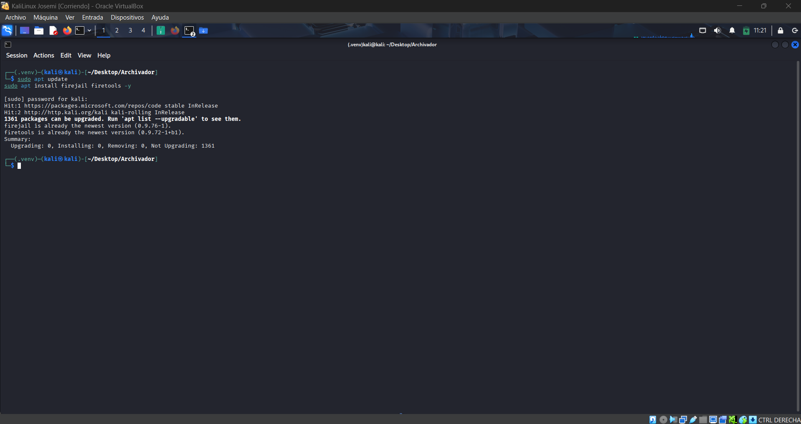
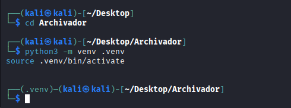
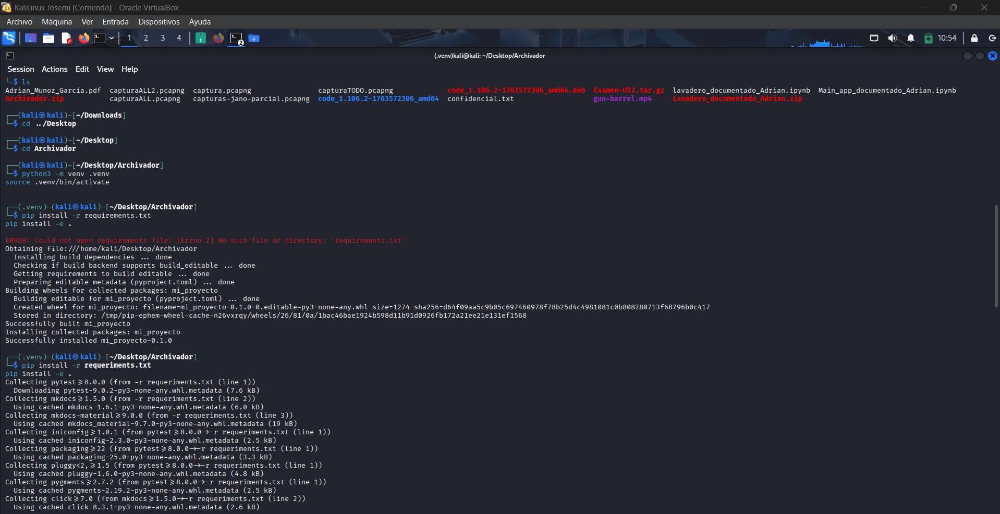
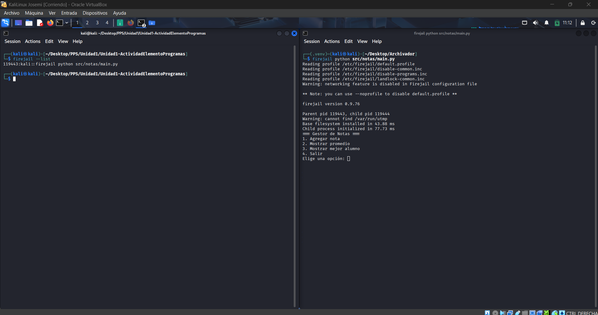

# Documentación de la práctica: ejecución en entorno aislado (Sandboxing)

## 1. Actualización de paquetes
Antes de instalar las herramientas necesarias, actualicé los repositorios del sistema:

```bash
sudo apt update
```

---

## 2. Instalación de Firejail y Firetools
Instalé las herramientas que permiten crear y gestionar entornos aislados:

```bash
sudo apt install firejail firetools -y
```

---

## 3. Acceso al proyecto
Me situé en la carpeta donde había descomprimido la aplicación de notas:

```bash
cd Archivador
```

---
## 4. Creación de entorno virtual en Python
Para aislar las dependencias de la aplicación, creé un entorno virtual:

```bash
python3 -m venv .venv
```

Y lo activé con:

```bash
source .venv/bin/activate
```

---

## 5. Instalación de dependencias
Instalé las librerías necesarias para que la aplicación funcionara:

```bash
pip install -r requeriments.txt  
pip install -e .
```

---

## 6. Ejecución de la aplicación en sandbox
Ejecuté la aplicación de notas dentro de un entorno controlado con Firejail:

```bash
firejail python src/notas/main.py
```

---

## 7. Verificación de procesos en Firejail
En otra terminal, comprobé que la aplicación estaba corriendo dentro del sandbox:

```bash
firejail --list
```

---

## Conclusión
Con estos pasos conseguí ejecutar la aplicación de notas en un entorno controlado utilizando Firejail. Esto garantiza que el programa no pueda acceder libremente a los recursos del sistema, aumentando la seguridad durante las pruebas.
